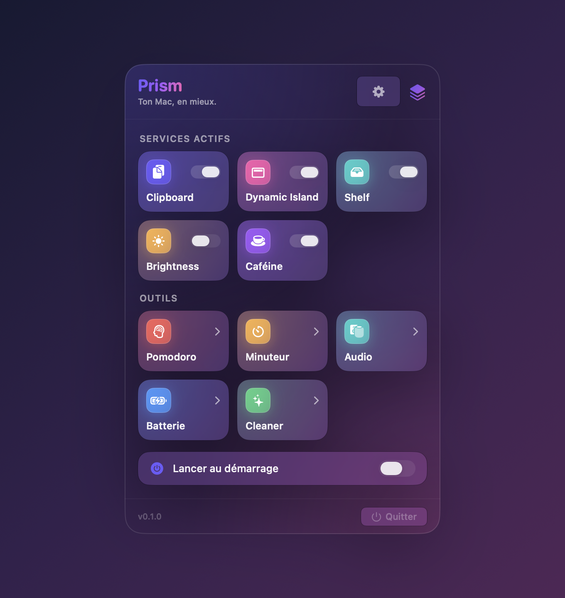
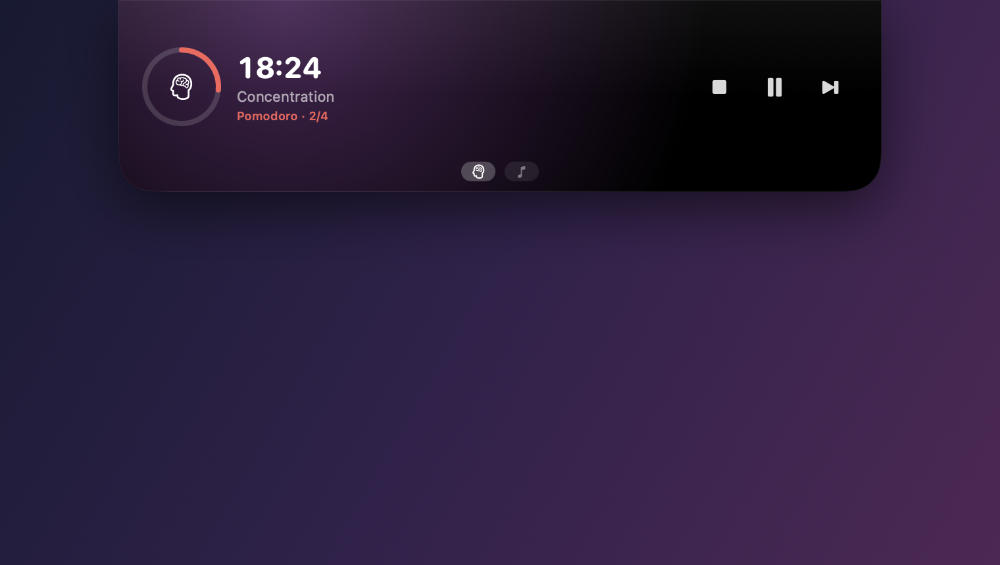
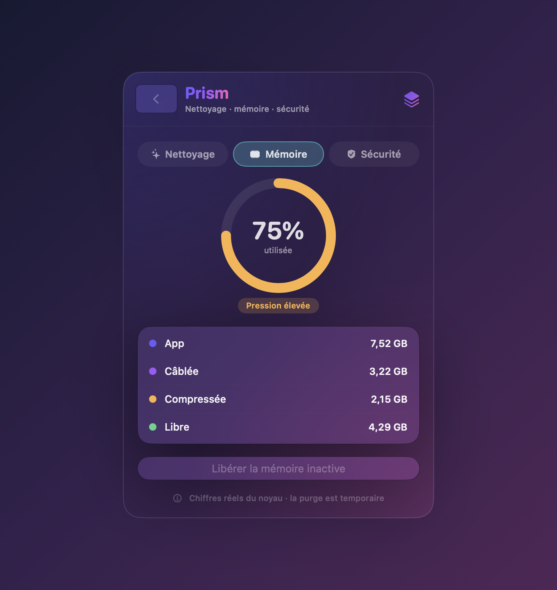
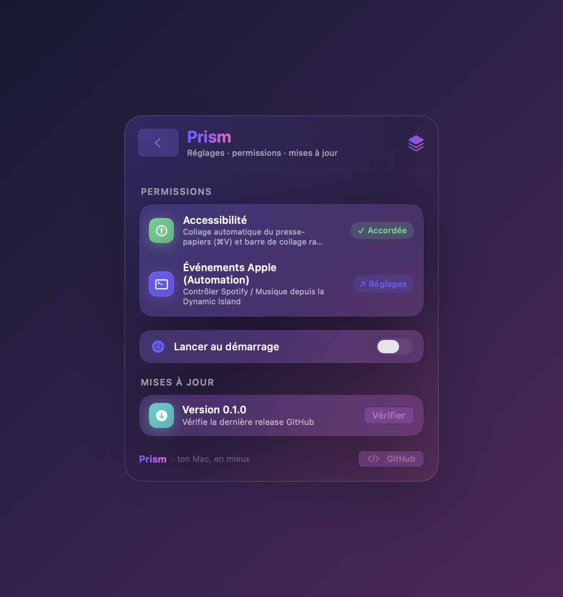

<div align="center">

# Prism

### Your Mac, but better — a Liquid Glass control center for the menu bar
### Ton Mac, en mieux — un control center Liquid Glass dans la barre de menus



</div>

---

**Prism** is a native macOS menu-bar app that bundles ten everyday utilities behind one gorgeous Liquid Glass panel — clipboard history, a Dynamic Island for the notch, a drag-and-drop shelf, brightness beyond max, keep-awake, a Pomodoro, a timer, an audio switcher, battery telemetry, and a Mac cleaner.

**Prism** est une app native de barre de menus macOS qui réunit dix utilitaires du quotidien derrière un seul panneau Liquid Glass — historique du presse-papiers, Dynamic Island sur l'encoche, étagère glisser-déposer, luminosité au-delà du max, anti-veille, Pomodoro, minuteur, switcher audio, télémétrie batterie et nettoyage du Mac.

<div align="center">

</div>

## ✨ Modules

| | Module | 🇬🇧 | 🇫🇷 |
|---|---|---|---|
| 📋 | **Clipboard** | Searchable, persistent clipboard history + a ⌘⇧V quick-paste bar | Historique du presse-papiers cherchable + barre de collage rapide ⌘⇧V |
| 🏝️ | **Dynamic Island** | Media HUD on the notch — and a live surface many modules feed | HUD média sur l'encoche — et une surface live alimentée par plusieurs modules |
| 🗂️ | **Shelf** | A right-edge drop shelf for files, images & text (à la Yoink) | Étagère à droite pour fichiers, images & texte (façon Yoink) |
| ☀️ | **Brightness** | Push the display past 100% using EDR — fully reversible | Pousse l'écran au-delà de 100% via EDR — 100% réversible |
| ☕ | **Caffeine** | Keep the Mac/display awake, with timed sessions | Empêche la veille écran/système, avec sessions minutées |
| 🧠 | **Pomodoro** | Focus timer with work/break cycles, shown live in the island | Minuteur de concentration avec cycles, live dans l'île |
| ⏱️ | **Timer** | Countdown + stopwatch, live in the island | Compte à rebours + chrono, live dans l'île |
| 🔊 | **Audio** | Switch output/input device and set volume in one click | Bascule sortie/entrée et volume en un clic |
| 🔋 | **Battery** | Health, cycles, charge & voltage from IOKit | Santé, cycles, charge & tension via IOKit |
| ✨ | **Cleaner** | Reclaim disk space · live memory monitor · startup/adware audit | Espace disque · moniteur mémoire · audit démarrage/adware |

<div align="center">
&nbsp;&nbsp;
</div>

## 📦 Install · Installation

1. Download **`Prism.dmg`** from the [latest release](../../releases/latest). — Télécharge **`Prism.dmg`** depuis la [dernière release](../../releases/latest).
2. Open it and drag **Prism** into **Applications**. — Ouvre-le et glisse **Prism** dans **Applications**.
3. First launch: **right-click → Open** (the app is self-signed, not notarized, so Gatekeeper asks once). — Premier lancement : **clic droit → Ouvrir** (app auto-signée, non notarisée : Gatekeeper demande une fois).

> **Requirements · Prérequis:** macOS 26+ (Liquid Glass) · Apple Silicon.

## 🔄 Auto-update · Mises à jour automatiques

Prism checks GitHub Releases from **Settings → Updates**. When a newer version is published, it downloads the release `.zip` and reinstalls in place **after you confirm** — preserving your granted permissions.

Prism vérifie les GitHub Releases depuis **Réglages → Mises à jour**. Quand une version plus récente est publiée, elle télécharge le `.zip` et réinstalle sur place **après ta confirmation** — en préservant les permissions accordées.

## 🔐 Permissions

Listed live in **Settings → Permissions** — Prism only asks for what a feature needs · Listées en direct dans **Réglages → Permissions** :

- **Accessibility · Accessibilité** — clipboard auto-paste (⌘V) and the quick-paste bar · collage automatique et barre de collage rapide.
- **Automation (Apple Events) · Événements Apple** — media controls for Spotify / Music from the island · contrôles média Spotify / Musique depuis l'île.

No data leaves your Mac. Prism is non-sandboxed and phones nowhere (beyond checking GitHub releases). · Aucune donnée ne quitte ton Mac.

## 🛠️ Build from source · Compiler

```bash
git clone https://github.com/CHANGE_ME/Prism.git
cd Prism
make app     # build dist/Prism.app
make run     # build + launch
make dmg     # build the .dmg
```

SwiftPM executable target · Swift 6 · no Xcode project needed. Requires the Swift 6.3 / Xcode 26 toolchain.

Deterministic per-screen preview (no full app launch) · Aperçu déterministe d'un écran :
```bash
bash Scripts/preview.sh out.png <hub|clipboard|shelf|cleaner|settings|notchbothbig|…>
```

## 🚀 Releasing (maintainer) · Publier une release

```bash
make cert                     # once: stable signing identity (keeps perms across updates)
# bump CFBundleShortVersionString in Resources/Info.plist
make release                  # builds Prism.dmg + Prism.zip
# create a GitHub release tagged vX.Y.Z, attach BOTH files
```

Signing every release with the same self-signed identity (`make cert`) is what lets granted permissions survive updates — macOS keys them to the signing identity, not the per-build hash. · Signer chaque release avec la même identité (`make cert`) est ce qui préserve les permissions à travers les mises à jour.

## 🏗️ Architecture

- **SwiftPM** executable (no `.xcodeproj`), menu-bar `LSUIElement` app via `MenuBarExtra`.
- `Sources/HubOS/{App,Core,UI,Features/<module>}` — one folder per module.
- `HubState` = module registry + toggles; design tokens in `UI/Theme.swift`, reusable glass in `UI/GlassKit.swift`; the Dynamic Island is a shared live surface in `Features/Notch`.

## 📄 License

MIT — see [LICENSE](LICENSE).

<div align="center">
<sub>Built with Liquid Glass on macOS · Fait avec Liquid Glass sur macOS</sub>
</div>
